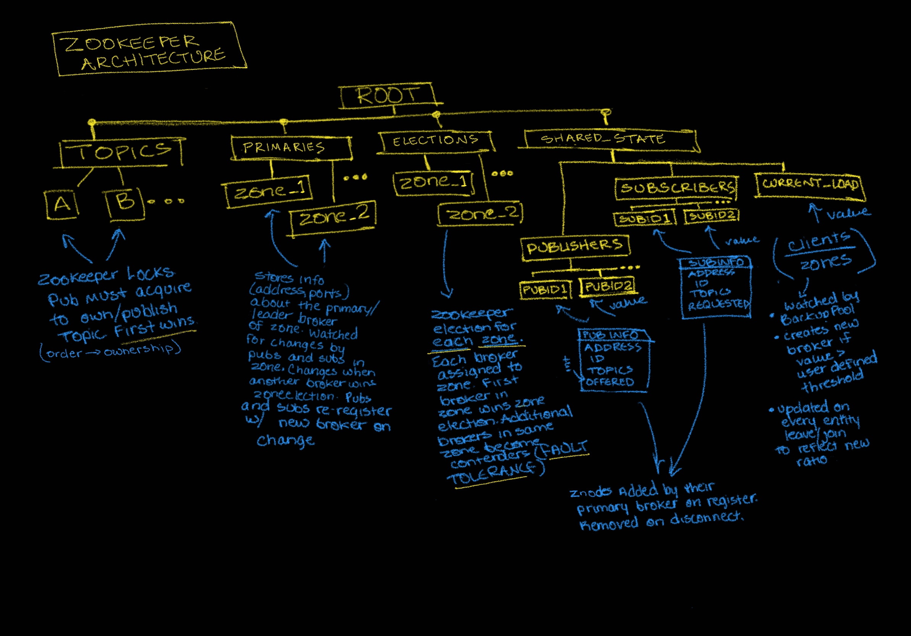

# A Python Framework for Multi-Broker Publish/Subscribe Distributed Systems Built With [ZeroMQ, an asynchronous messaging library](https://zeromq.org/) and [Apache Zookeeper](https://zookeeper.apache.org), a distributed coordination service

## [Watch this video demonstration of the framework on YouTube](https://youtu.be/a9ziTc_xPyA)

This project is the 3rd iteration of a Python framework for creating distributed **publish/subscribe** systems on virtualized networks. It builds on [this project, the second iteration](https://github.com/austinjhunt/vanderbiltcs6381-assignment2-ZOOKEEPER), which built on [this project, the first iteration](https://github.com/austinjhunt/vanderbiltcs6381-assignment1-ZMQPUBSUB). It offers a framework for spinning up a publish/subscribe system either on a single host or on a virtualized network with a tool like [Mininet](http://mininet.org/). It offers two main models of message dissemination, namely centralized dissemination (message broker forwards all messages from publisher to subscriber and decouples/anonymizes their communication) and decentralized dissemination (publisher and subscriber speak directly with each other after broker matches them with each other).

It offers integrated performance / latency analysis by allowing you to configure subscribers to write out latency data (between publishers and subscribers) to a provided filename, which provide insight about how long it takes for messages with specific topics from specific publishers to reach the subscriber (this is done by including the publish time in the message that gets sent).

## How does this project extend on the other?
The previous project (iteration 2) extended the first by adding in [Apache ZooKeeper](https://zookeeper.apache.org) for distributed coordination. Specifically, it used [kazoo, a Python library for ZooKeeper](https://kazoo.readthedocs.io/en/latest/), to handle **multi-broker** pub/sub with **warm passive replication** between brokers. The ZooKeeper usage was completely transparent, meaning if you used one broker, the project functions exactly the same as the first (which did not use ZooKeeper and was only functional with one broker). If you use multiple brokers in iteration 2, and one broker fails, ZooKeeper enables all publishers and subscribers to continue functioning as though nothing happened by simply electing the next available broker as the leader.

This project focuses on adding Quality of Service properties to the framework, and will extend on iteration 2 in **three primary ways**:
1. Load balancing, in addition to fault tolerance. Previously, we used Zookeeper for fault tolerance using the primary-backup scheme without caring about the load on the primary broker. Now, we introduce load balancing such that there can be multiple primary broker replicas that each handle requests from clients (a client is a publisher or a subscriber). Each message broker that gets created gets assigned to a **zone**. The first broker assigned to a zone becomes its primary broker (or "leader"), then any additional brokers assigned to that zone become "contenders" for leadership in that zone,  so each zone has one primary leader broker and a set of backup brokers that step in if the current primary fails (thus, each zone has its own **fault tolerance**). Load is balanced across "zones" by **randomly** assigning clients (pubs and subs) to one of the available zones at the time of creation. Ex: if there are 3 zones, each with a primary broker as its leader, and I create a publisher, that publisher gets randomly assigned to one of those 3 zones. A "Backup" process keeps track of the current system load (defined as (number of publishers + number of subscribers) / (number of zones)), AKA "clients per zone" as it relates to a user-defined threshold. When the load exceeds the user-defined threshold, a new broker gets created and added to a brand new zone for more distributed load balancing, and new clients include the new zone in the random zone assignment decision.

2. Ownership strength. In the previous iterations, if we had more than one publisher publishing the same topic T, then all the events from all of those publishers would get relayed to the subscribers subscribed to topic T. Now, we introduce a measure of topic ownership for publishers, so that only messages about topic T from the publisher with the highest ownership strength over that topic T are relayed to the interested subscribers. The first publisher to publish about a topic becomes the owner for that topic by acquiring an Apache Zookeeper lock representing that topic. Any other publisher that tries to publish about that topic will not be able to until that lock is released, which happens when the first publisher process ends, intentionally or not.

3. History. In the previous iterations, when a publisher of topic T and a subscriber to topic T registered with a broker, that publisher and that subscriber were matched based on that topic T, and the subscriber would receive all messages about topic T, one at a time, as the publisher published those messages. Now, we introduce a new requirement that the last N messages published about a topic T be preserved in a sliding window fashion, and a subscriber to T can only receive messages from a publisher if T the subscriber requests some number of messages less than or equal to the size of that sliding window offered by the publisher. In other words, the publisher's "offered" historical window of messages MUST be greater than or equal to the subscriber's "requested" number of historical messages. If a publisher maintains the last 10 samples of topic T while a subscriber wants the last 20 samples of topic T, then this subscriber cannot get the data even though the topic of interest is common, because the "offered vs requested" dominance relationship is not satisfied.

### How is ZooKeeper used?
#### ZooKeeper Architecture: A Visual

#### Leader Election
In the previous iteration, there was only Zookeeper broker election observed by the brokers to achieve fault tolerance. This used the `/electionpath` znode with ZooKeeper. The first broker to get created won the election immediately and became the leader, and any subsequent brokers would become "contenders" for the leadership by entering the `/electionpath` election and waiting for the current leader to fail.
Now, with the load balancing model, we have multiple zones that each have their own broker elections. So instead of elections being managed with a single `/electionpath` znode, elections are now managed per-zone, with `/elections/zone_<zoneNumber>`. Within a given zone, the leader election happens the same way as before. When you create a broker, you assign it to a zone. If it's the first broker assigned to that zone, the zone-related znodes are initialized (including that election znode) and that broker becomes the zone's primary, or leader. If you assign a broker to a zone that already has a primary, it will enter the election for that zone and wait for the zone's primary to fail as a "contender" in the zone's leader election. This provides fault tolerance for each zone in the system.
#### Shared State
We also now use ZooKeeper to maintain shared state across all of the brokers, particularly for the synchronization of matchmaking data. Why did we do this? Well, assume we hadn't. Now, imagine a publisher of Topic A with an offered history of 5 gets created and is randomly assigned to zone 3, which means it registers with zone 3's primary broker. Then, a subscriber to Topic A with a requested history of 2 gets created and is randomly assigned to zone 1. Regardless of centralized vs decentralized dissemination, without shared state across the brokers in the different zones, the subscriber would not know about the publisher even though it publishes its topic of interest and satisfies the offered vs requested dominance relationship. So, here's how the shared state works:
1. Each broker watches a `/shared_state/publishers` znode with @ChildrenWatch to monitor for additions or removals of publishers by any of the other brokers, regardless of zone
   1. When the children change, the watch triggers and the broker updates it internal matchmaking data to reflect the global shared state.
2. Each broker watches a `/shared_state/subscribers` znode with @ChildrenWatch to monitor for additions or removals of subscribers by any of the other brokers, regardless of zone
   1. When the children change, the watch triggers and the broker updates it internal matchmaking data to reflect the global shared state.
3. Once a publisher gets randomly assigned to a zone on creation, it registers with that zone's primary broker, at which point the broker adds a znode named with the publisher's ID as a child of the `/shared_state/publishers` znode, with JSON containing the publisher's ID (str), Topics (list), Offered (int), and Address (str)
4. Once a subscriber gets randomly assigned to a zone on creation, it registers with that zone's primary broker, at which point the broker adds a znode named with the subscriber's ID as a child of the `/shared_state/subscribers` znode, with JSON containing the subscriber's ID (str), Topics (list), Offered (int), and Address (str)
5. When a publisher disconnects, it tells the broker before disconnecting, and the broker removes its respective znode from the children of the `/shared_state/publishers` znode
6. When a subscriber disconnects, it tells the broker before disconnecting, and the broker removes its respective znode from the children of the `/shared_state/subscriber` znode

This allows the brokers in the various load-balanced zones to know about a global state across all of the zones so that cross-zone matchmaking between publishers and subscribers can still work.
#### Load Monitoring and Auto-Broker Provisioning
In order to achieve dynamic scaling according to system load, we use another ZooKeeper znode called `/shared_state/current_load`. Here's how it is used:
1. We have a BackupPool process that watches this znode for data changes with @DataWatch.
   1. When it changes, if the value of the znode (the current system load) is greater than a user defined threshold passed to the the Backup Pool process, then provision, configure, and start a new broker as the primary of a brand new zone.
2. Whenever a new publisher or a subscriber registers OR disconnects with any broker in any zone, update `/shared_state/current_load` to reflect the current value of the following formula: (num_publishers + num_subscribers) / (num_zones). Generally speaking, registration means load increase, disconnection means load decrease.
#### Watch Event
In the previous iteration, each publisher and subscriber set a watch on the znode **/broker** which would store the information about the current leader, or primary, broker, which most recently won the `/electionpath` election. Now, as we have made the elections zone-specific with `/elections/zone_<zoneNumber>`, we have also made this primary broker info storage zone specific, since each zone has its own primary, or leader. So instead of writing its information to `/broker` when a broker becomes a zone leader, it writes its information to `/primaries/zone_<zoneNumber>` when it becomes a zone leader. In return, the publishers and subscribers, after getting randomly assigned to a zone on creation, watch the respective `/primaries/zone_<zoneNumber>` to obtain the most updated information about their current broker leader. If it changes, that means the previous primary/leader broker has died or has been manually terminated and they register with the next broker contender who wins the zone's election.
## Set Up Your Development Environment
To work with this system, you should do the following:
1. Install [VirtualBox](https://www.virtualbox.org/)
2. Set up an Ubuntu Desktop 20.04 virtual machine within VirtualBox. You can download the Ubuntu .iso file [here](https://ubuntu.com/download/server). You can follow [these instructions](https://www.youtube.com/watch?v=x5MhydijWmc) to set up your Ubuntu VM. Proceed when finished setting up your VM and it's started.
3.  Open a Terminal Window in your VM. Become root with: `sudo -i` and enter your sudo password.
4. Run the following commands to install Python3.8 and pip on your VM.
```
apt update
apt install software-properties-common
add-apt-repository ppa:deadsnakes/ppa
apt install python3.8
apt install python3-pip
```
5. Install Mininet using [Option 2: Native Installation from Source](http://mininet.org/download/) on the Mininet homepage, with the Python3 note at the bottom of the page.
```
cd /opt/
git clone git://github.com/mininet/mininet
cd mininet
git checkout -b mininet-2.3.0 2.3.0
cd ..
PYTHON=python3 mininet/util/install.sh -a
```
6. Clone this project into /opt/ on the VM.
```
cd /opt/
git clone https://github.com/austinjhunt/vanderbiltcs6381-assignment2-ZOOKEEPER.git
```
7. Navigate to the project.
```
cd vanderbiltcs6381-assignment2-ZOOKEEPER
```
8.  Now as root, install the Python requirements in the VM.
```
pip install -r requirements.txt
```
9. Now, [install ZooKeeper](https://phoenixnap.com/kb/install-apache-zookeeper) on your Ubuntu VM and start the ZooKeeper service. (Step 6 in the linked instructions)

You have now cloned the project onto an Ubuntu VM, started ZooKeeper, installed Mininet, and installed all Python requirements as root on your VM. Your development environment is ready to go.

## Architecture

The main underlying architecture of the publish/subscribe system is described in the original Pub/Sub Framework project's [README](https://github.com/austinjhunt/vanderbiltcs6381-assignment1-ZMQPUBSUB#architecture).

## Unit Testing [(src/unit_tests)](src/unit_tests/README.md)

For instructions on executing the unit tests, see the [Unit Tests README](src/unit_tests/README.md).

## Performance Testing

To test the performance of this framework (specifically latency for message dissemination across both centralized and decentralized dissemination), we rely on the same underlying performance testing module of the original project, [documented here.](https://github.com/austinjhunt/vanderbiltcs6381-assignment1-ZMQPUBSUB/tree/master/src/performance_tests#readme)

For instructions on executing the Performance Tests, see the [Performance Tests README](src/performance_tests/README.md).
### Performance Patterns Found
There are several interesting observations can be made from the tests that have been run within the Performance Testing Framework:
1. The latency with direct dissemination is in general smaller than that with centralized dissemination.
2. The distribution of latency for direct dissemination is more uniformly distributed without outliers, while there are extra large latencies with centralized dissemination
3. With an increased number of publishers and subscribers, the latency increases for both direct and centralized dissemination.
4. The impact of increased number of publishers and subscribers on centralized dissemination is larger than that on direct dissemination.
5. The relationship between the increase of latency and the increase of publishers/subscribers are non-linear. It seems to be a quadratic relationship. More testing is required to confirm this.

## Test Steps for Peer Review

The following is a list of steps you can take to perform two quick tests on the framework without dealing with all of the automation. The tests can be conducted in localhost environment and in mininet environment. For each environment, there are the test for decentralized mode (where pubs and subs are in direct contact) and centralized mode (where the broker forwards all messages).

### These commands have been tested on an Ubuntu 20.04 VM. Each command can be executed in its own terminal window alongside other terminal windows.

### Testing with localhost

#### FIRST, start ZooKeeper Service (if not already started)

** Please Note: Common default 2181 is used as the port for zookeeper. If different port is used, when providing the `zookeeper_host` argument, it should be changed accordingly. **

Zookeeper Server - Terminal Window #1.
1. `cd /opt/`
2. `zookeeper/bin/zkServer.sh start`

#### Steps for Decentralized Testing
1. Cd into src directory of project
`cd src/`
2. Create TWO decentralized brokers. Since it is on the same localhost for the two brokers, each broker has its own set of ports opened for publisher registration and subscriber registration.
   1. Broker 1 - Terminal Window #2.
      1. `python3 driver.py --broker 1 --verbose --indefinite --zookeeper_host 127.0.0.1:2181 --pub_reg_port 10000 --sub_reg_port 10001`
   2. Broker 2 - Terminal Window #3.
      1. `python3 driver.py --broker 1 --verbose --indefinite --zookeeper_host 127.0.0.1:2181 --pub_reg_port 20000 --sub_reg_port 20001`
3. Create TWO publishers
  1. Publishers 1 - Terminal Window #4.
     1. `python3 driver.py --publisher 1 --verbose --max_event_count 120 --sleep 0.5 --zookeeper_host 127.0.0.1:2181 --topics A --topics B`
  2. Publishers 2 - Terminal Window #5.
     1. `python3 driver.py --publisher 1 --verbose --max_event_count 120 --sleep 0.5 --zookeeper_host 127.0.0.1:2181 --topics B --topics D`
4. Create TWO subscribers. Each subscriber will write the message that they have received to a txt file
 1. Subscriber 1 - Terminal Window #6.
    1. `python3 driver.py --subscriber 1 --verbose --max_event_count 60 --zookeeper_host 127.0.0.1:2181 --topics A --topics D --filename s1_local_direct.txt`
 2. Subscriber 2 - Terminal Window #7.
    1. `python3 driver.py --subscriber 1 --verbose --max_event_count 60 --zookeeper_host 127.0.0.1:2181 --topics B --filename s2_local_direct.txt`
5. Terminate active broker, broker 1 (Terminal Window #2) by pressing CTRL + C on the broker. You should find the standby broker in Terminal Window #3 become active. You should also see the publisher and subscriber switch to the new broker in their logs.
#### Steps for Centralized Testing
** Please Note: To make everything centralized, the `--centralized` parameter needs to be provided when create the broker, publisher and subscriber. All other remain the same **

1. Cd into src directory of project
`cd src/`
2. Create TWO decentralized brokers. Since it is on the same localhost for the two brokers, each broker has its own set of ports opened for publisher registration and subscriber registration.
   1. Broker 1 - Terminal Window #2.
      1. `python3 driver.py --broker 1 --verbose --indefinite --zookeeper_host 127.0.0.1:2181 --pub_reg_port 10000 --sub_reg_port 10001 --centralized`
   2. Broker 2 - Terminal Window #3.
      1. `python3 driver.py --broker 1 --verbose --indefinite --zookeeper_host 127.0.0.1:2181 --pub_reg_port 20000 --sub_reg_port 20001 --centralized`
3. Create TWO publishers
  1. Publishers 1 - Terminal Window #4.
     1. `python3 driver.py --publisher 1 --verbose --max_event_count 120 --sleep 0.5 --zookeeper_host 127.0.0.1:2181 --topics A --topics B --centralized`
  2. Publishers 2 - Terminal Window #5.
     1. `python3 driver.py --publisher 1 --verbose --max_event_count 120 --sleep 0.5 --zookeeper_host 127.0.0.1:2181 --topics B --topics D --centralized`
4. Create TWO subscribers. Each subscriber will write the message that they have received to a txt file
 1. Subscriber 1 - Terminal Window #6.
    1. `python3 driver.py --subscriber 1 --verbose --max_event_count 60 --zookeeper_host 127.0.0.1:2181 --topics A --topics D --filename s1_central_direct.txt --centralized`
 2. Subscriber 2 - Terminal Window #7.
    1. `python3 driver.py --subscriber 1 --verbose --max_event_count 60 --zookeeper_host 127.0.0.1:2181 --topics B --filename s2_central_direct.txt --centralized`
5. Terminate active broker, broker 1 (Terminal Window #2) by pressing CTRL + C on the broker. You should find the standby broker in Terminal Window #3 become active. You should also see the publisher and subscriber switch to the new broker in their logs.

**Video Demo: https://youtu.be/F7_o7OdGvgA**


### Testing with Mininet

#### FIRST, start the Mininet and open xterm from host 1 to host 7
1. `sudo mn --topo tree,depth=2,fanout=3`
2. `xterm h1`
3. `xterm h2`
4. `xterm h3`
5. `xterm h4`
6. `xterm h5`
7. `xterm h6`
8. `xterm h7`

#### Second, start ZooKeeper Service on h1 within the xterm window opened for h1

** Please Note: within Mininet, the IP address for h1 is `10.0.0.1`. Since
h1 is used as the ZooKeeper server, its IP address is passed in `zookeeper_host` argument.
Other host can be used as well, but the corresponding IP address needs to be provided for the
`zookeeper_host` argument**

** Please Note: Common default 2181 is used as the port for zookeeper. If different port is used, when providing the `zookeeper_host` argument, it should be changed accordingly. **

Zookeeper Server on h1.
1. `cd /opt/`
2. `zookeeper/bin/zkServer.sh start`

#### Steps for Decentralized Testing
1. Cd into src directory of project
`cd src/`
2. Create TWO decentralized brokers.
   1. Broker 1 - Terminal window of h2.
      1. `python3 driver.py --broker 1 --verbose --indefinite --zookeeper_host 10.0.0.1:2181`
   2. Broker 2 - Terminal window of h3.
      1. `python3 driver.py --broker 1 --verbose --indefinite --zookeeper_host 10.0.0.1:2181`
3. Create TWO publishers
  1. Publishers 1 - Terminal window of h4.
     1. `python3 driver.py --publisher 1 --verbose --max_event_count 120 --sleep 0.5 --zookeeper_host 10.0.0.1:2181 --topics A --topics B`
  2. Publishers 2 - Terminal window of h5.
     1. `python3 driver.py --publisher 1 --verbose --max_event_count 120 --sleep 0.5 --zookeeper_host 10.0.0.1:2181 --topics B --topics D`
4. Create TWO subscribers. Each subscriber will write the message that they have received to a txt file
 1. Subscriber 1 - Terminal window of h6.
    1. `python3 driver.py --subscriber 1 --verbose --max_event_count 60 --zookeeper_host 10.0.0.1:2181 --topics A --topics D --filename s1_mn_direct.txt`
 2. Subscriber 2 - Terminal window of h7.
    1. `python3 driver.py --subscriber 1 --verbose --max_event_count 60 --zookeeper_host 10.0.0.1:2181 --topics B --filename s2_mn_direct.txt`
5. Terminate active broker, broker 1 (Terminal Window of h2) by pressing CTRL + C on the broker. You should find the standby broker of h3 become active. You should also see the publisher and subscriber switch to the new broker in their logs.

**Video Demo: https://youtu.be/ryUrtIuSRdw**

#### Steps for Centralized Testing
** Please Note: To make everything centralized, the `--centralized` parameter needs to be provided when create the broker, publisher and subscriber. All other remain the same **

1. Cd into src directory of project
`cd src/`
2. Create TWO decentralized brokers.
   1. Broker 1 - Terminal window of h2.
      1. `python3 driver.py --broker 1 --verbose --indefinite --zookeeper_host 10.0.0.1:2181 --centralized`
   2. Broker 2 - Terminal window of h3.
      1. `python3 driver.py --broker 1 --verbose --indefinite --zookeeper_host 10.0.0.1:2181 --centralized`
3. Create TWO publishers
  1. Publishers 1 - Terminal window of h4.
     1. `python3 driver.py --publisher 1 --verbose --max_event_count 120 --sleep 0.5 --zookeeper_host 10.0.0.1:2181 --topics A --topics B --centralized`
  2. Publishers 2 - Terminal window of h5.
     1. `python3 driver.py --publisher 1 --verbose --max_event_count 120 --sleep 0.5 --zookeeper_host 10.0.0.1:2181 --topics B --topics D --centralized`
4. Create TWO subscribers. Each subscriber will write the message that they have received to a txt file
 1. Subscriber 1 - Terminal window of h6.
    1. `python3 driver.py --subscriber 1 --verbose --max_event_count 60 --zookeeper_host 10.0.0.1:2181 --topics A --topics D --filename s1_mn_central.txt --centralized`
 2. Subscriber 2 - Terminal window of h7.
    1. `python3 driver.py --subscriber 1 --verbose --max_event_count 60 --zookeeper_host 10.0.0.1:2181 --topics B --filename s2_mn_central.txt --centralized`
5. Terminate active broker, broker 1 (Terminal Window of h2) by pressing CTRL + C on the broker. You should find the standby broker of h3 become active. You should also see the publisher and subscriber switch to the new broker in their logs.

**Video Demo: https://youtu.be/jNFdwGUt5w0**
